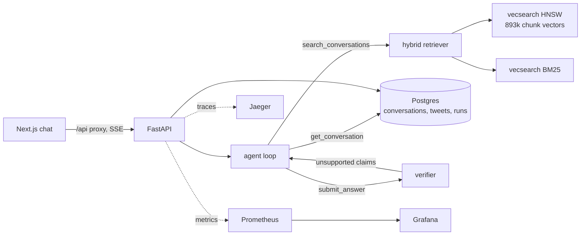

# support-rag

Question answering over ~800k real customer-support conversations (Twitter, 2017) with an agent that searches, reads sources, drafts an answer, and has every answer checked against the conversations it cites before you see it.

Retrieval runs on [vecsearch](https://github.com/Manojkaipu/vecsearch), my C++ HNSW library, extended here with a BM25 index, filtered graph search and reciprocal rank fusion.

## Results

96 hand-reviewed questions: 86 answerable, spread over 30 companies, and 10 that the history can't answer. The agent and the verifier are `grok-4.7` at high reasoning effort.

### Answers

| scored by | answerable: correct and grounded | unanswerable: correctly declined |
|---|---|---|
| Grok judge (`grok-4.7`) | 80/86 (93%) | 10/10 |
| OpenAI judge (`gpt-6-sol`) | 77/86 (90%) | 10/10 |
| **the rules from my hand check** (grounded from the OpenAI judge, correct from the Grok judge) | **78/86 (91%)** | **10/10** |

The last row combines the two judges in the way my hand grades favoured (see [Judges and the hand check](#judges-and-the-hand-check)). That choice was made after looking at the results, so the other two rows stay alongside it.

- **Declining when the data doesn't cover it:** all 10 unanswerable questions were declined, including the ones built as traps. Asked about Ryanair's pet policy, it didn't pass off British Airways' or Delta's.
- **Grounding:** under the stricter rule, 85 of the 94 answers given are fully grounded. Most of the other 9 add uncited commentary, like "searches only turned up X" or "this rule no longer applies", rather than inventing policy.
- **Cost:** $13.76 for the whole run ($12.65 agent and verifier, $1.11 judge), about $0.13 per question.
- **Speed:** median 130 s per question, p90 376 s. That's typically about 8 model calls at high reasoning effort.

**What went wrong**, from reading every failed answer:

| cause | count | detail |
|---|---|---|
| ran out of turns | 2 | It found the source both times. The verifier rejected a submission made on the last turn, and the loop dropped it instead of returning it as unverified. **A bug in the loop, since fixed.** |
| retrieval miss | 1 | Only one of the 16 Comcast conversations about the "Level 3" outage has an agent naming it as the cause. The agent never reached it and concluded Comcast hadn't named one. Along the way this exposed a real bug: vecsearch's BM25 tokenizer dropped one-character tokens, so "Level 3" was searched as "level". **Fixed:** the source moves from rank 46 to 21 for a "Level 3 outage" search, which is still outside the 8 results the agent reads. |
| overgeneralized | 1 | Said Safaricom calls only from one number; agents also mention a second one used during promotions. |
| missed part of the reference | 2 | Grounded answers without a secondary point from the reference. The two judges disagree on whether that counts as a failure. |

### Retrieval

Is the conversation a question was written from in the top k? Conversation-level, 86 answerable questions:

| search | hit@1 | hit@5 | hit@10 | MRR | p50 latency |
|---|---|---|---|---|---|
| BM25 | 0.27 | 0.42 | 0.50 | 0.34 | 6.9 ms |
| vector | 0.31 | 0.48 | 0.55 | 0.40 | 6.6 ms |
| **hybrid (RRF)** | 0.29 | **0.53** | **0.66** | **0.40** | 17.8 ms |
| hybrid + company filter | 0.33 | 0.55 | 0.66 | 0.42 | 10.2 ms |

These are with the BM25 tokenizer fix; before it, hybrid hit@10 was 0.65. Latency includes embedding the query and was measured on an otherwise idle machine. The numbers are lower bounds, since other conversations often give the same answer. In the answer run, the agent found the source conversation for 71% of questions but answered 91% correctly.

A company filter is applied inside the index rather than to its results. [vecsearch's README](https://github.com/Manojkaipu/vecsearch#filtered-and-hybrid-search) has the benchmark by filter selectivity. Post-filtering loses up to 19% recall on small companies; filtering inside the graph plus an exact scan below 5,000 allowed chunks keeps recall ≥ 0.975.

### Judges and the hand check

An LLM grading answers from its own model family can be lenient, so every answer was graded twice, by Grok and by OpenAI, from identical text with the same rubric:

| dimension | agreement | Cohen's κ |
|---|---|---|
| grounded | 95% | 0.59 |
| correct | 97% | 0.65 |
| declined | 100% | 1.00 |

κ is only moderate despite ~96% agreement because nearly every answer passes.

I then graded 10 answers by hand, starting with the 8 the judges disagreed on:

| | Grok judge | OpenAI judge |
|---|---|---|
| grounded: agrees with me | 5/10 | **10/10** |
| correct: agrees with me | **9/10** | 8/10 |

- **On grounding, Grok was too lenient.** It accepted uncited remarks, and a detail that came from a customer rather than an agent.
- **On correctness, OpenAI was too strict.** It failed answers for leaving out something the customer, not the agent, had said.

My rule: an answer is grounded only if everything it asserts comes from a support agent (customers' words are fine as context), and it's correct if it answers the question asked. Since the 10 were chosen for disagreement, these rates describe the hard cases, not overall judge accuracy.

## How it works



**Data.** The Kaggle "Customer Support on Twitter" dump is 2.8M tweets. Tweets are grouped into conversations by following reply links, with one fix that mattered: some tweets collect replies from many unrelated people (a company's "Welcome! Follow us" post, a CEO's viral tweet), and naive threading merged them into 1,000-turn "conversations". A tweet whose replies come from three or more authors, or a company-authored root with two or more replies, is treated as a hub and each reply starts its own conversation. That gives 824,495 conversations from 108 companies. Conversations longer than the embedding model's 256-token window (5.5%) are split into overlapping windows of whole turns, each prefixed with the customer's opening message, for 892,800 chunks.

**Retrieval.** Every chunk is in two indexes: an HNSW graph over all-MiniLM-L6-v2 embeddings and a BM25 inverted index, both in vecsearch. Each returns chunks, which are collapsed to conversations (best chunk wins) and fused with reciprocal rank fusion. A company filter is applied inside both indexes: HNSW keeps walking through filtered-out nodes so the graph stays connected, and switches to an exact scan when a filter leaves too few candidates.

**Agent.** An LLM with three tools: `search_conversations(query, company)`, `get_conversation(id)` and `submit_answer(answer, cited_ids, answerable)`. `company` is an enum of the 108 real handles, and every tool input is validated against its schema, so a malformed call comes back to the model as an error it can fix. A submitted answer goes to a separate verifier call that checks each claim against the cited conversations; unsupported claims go back to the agent as the tool result and it revises (twice at most). Answers that still fail are shown with an "unverified" badge rather than hidden.

The model sits behind a small provider interface (`rag/llm.py`), selected by `LLM_PROVIDER`:
- **xAI** (default, `grok-4.7`): the Responses API through the OpenAI SDK. Turns are chained with `previous_response_id`, and the verifier and judge use JSON-schema output. Cost comes from the billed `cost_in_usd_ticks` on each response.
- **OpenAI** (`gpt-6-sol`): the same Responses code at OpenAI's endpoint. It's used here for the independent second judge.
- **Anthropic** (`claude-opus-5`): the Messages API with strict tools, adaptive thinking, prompt caching and server-side refusal fallback.

**Backend.** FastAPI, async SQLAlchemy over Postgres. `POST /api/ask` streams the agent's steps as server-sent events and stores every run and event, including runs the client abandons (which also stops the agent, so nobody pays for an answer nobody reads).

**Frontend.** Next.js / React / TypeScript. Shows the agent's plan, searches, the conversations it read and each verification pass as they happen, then the answer with citation chips that open the source thread.

**Observability.** One OpenTelemetry trace per question with spans for every model call (tokens, cost), tool call, verification and retrieval stage. Prometheus metrics for latency, token spend by model and role, answer outcomes and retrieval hit rate, on a provisioned Grafana dashboard.

## Evaluation

`eval/questions.jsonl` has 100 drafted questions. After review, 96 are used: 86 answerable across 30 companies, and 10 that the history can't answer. The unanswerable ones are about companies or products that aren't in the data, some chosen because a similar company is, to catch the agent substituting one company's policy for another's.

- **Retrieval** (`eval/retrieval_eval.py`): hit@k, recall@k and MRR at conversation level for vector, BM25 and hybrid, with and without the company filter.
- **Answers** (`eval/answer_eval.py`): runs the agent on every question and has a judge grade groundedness, correctness against the reference answer and abstention, with a failure mode. A failure whose source conversation was never retrieved is labelled a retrieval miss from the run's own events, not by the judge.
- **Second judge** (`eval/second_judge.py`): re-grades every answer with a model from another family, from the same text, and reports agreement.
- **Hand check** (`eval/judge_agreement.py`): my grades for 10 answers, disagreements first, compared with both judges.

**How the questions were made.** Claude drafted them from a seeded, stratified sample of real conversations (`eval/sample_candidates.py`), keeping only single-customer conversations where the company's reply says something concrete. Each question is tied to the conversation(s) it came from. I reviewed every question against its source conversation (`eval/review_sheet.md`) and rejected 4: in those, the company's reply didn't really answer, the fix came from the customer, or agents contradicted each other. Gold labels only list the source conversations, so retrieval numbers are lower bounds.

## Running it

Everything runs on one machine (developed on a Windows laptop under WSL2 Ubuntu).

```bash
# Postgres, then the corpus
python -m rag.ingest.conversations --csv twcs.csv   # ~4 min: conversations, chunks, Postgres
python -m rag.ingest.indexes bm25                   # ~10 s
python -m rag.ingest.indexes embed                  # ~3 h on 8 CPU cores, resumable; then builds HNSW

# API and UI
echo "XAI_API_KEY=..." >> .env        # or LLM_PROVIDER=anthropic plus ANTHROPIC_API_KEY=...
uvicorn rag.api.main:app --port 8000
cd web && npm install && API_URL=http://localhost:8000 npm run dev
```

On a local Kubernetes cluster:

```bash
docker buildx build --load --build-context vecsearch=../vecsearch -t support-rag-api:dev .
docker buildx build --load -t support-rag-web:dev web
kind create cluster --config deploy/kind/cluster.yaml     # mounts data/ into the node
kind load docker-image --name support-rag support-rag-api:dev support-rag-web:dev
kubectl create secret generic llm-keys --from-literal=XAI_API_KEY=...
helm install rag deploy/helm/support-rag
```

The chart runs Postgres, the API (indexes mounted read-only from the node), the web UI, a post-install job that loads the corpus, and Prometheus, Grafana and Jaeger. Web UI on http://localhost:30080, Grafana on :30300, Jaeger on :30686.

## How I used AI tools

Claude (via Claude Code) wrote most of the code in this repo and in vecsearch's BM25 and filtered search, drafted the evaluation questions, and ran the pipeline and the evaluations on my laptop.

My part:
* the plan and scope, and the choice of models and budgets;
* reviewing all 100 questions against their source conversations (4 rejected);
* setting the grading rules and grading 10 answers by hand.

Mistakes along the way, each caught by a check rather than noticed later:
* **Merged conversations.** Reply-link threading merged unrelated customers under broadcast tweets into 1,000-turn "conversations". A spot check of the loaded data caught it before the 3-hour embedding run.
* **Garbage filter mask.** The Python binding treated an empty array as a filter, so unfiltered searches read a garbage mask. An existing recall test dropped to 0.60 and caught it.
* **Guessed threshold.** The exact-scan threshold was first guessed at 20,000 allowed chunks. The filter benchmark put it at 5,000.
* **Aborted first run.** The first full evaluation used an 8-turn cap that was too tight for Grok, and it read a copy of the question file whose review status had been reset. I stopped it after 15 questions ($1.46; kept in `results/aborted_run_8turns.jsonl`). The eval now refuses to run on unreviewed questions.
* **API crash on restart.** The API crashed on startup when Postgres wasn't reachable yet after a node restart. It now waits for it.

## Limitations

- 6.6% of conversations still contain more than one customer: support agents reply in chains where each customer answers the agent's previous reply, which reply links can't separate. Eval questions come from single-customer conversations only.
- Many company replies are just "DM us" or a link; the text behind shortened links isn't in the dataset, so the system can only report what the tweets themselves say.
- Everything is from late 2017. The agent is told to say so when an answer may have changed.
- Slow: a median of 130 s per question with Grok at high reasoning effort. Lower effort is the obvious next experiment, measured against this baseline.
- Two bugs found by the evaluation were fixed after the baseline run: BM25 now keeps one-character tokens, and a last-turn answer the verifier rejects is returned as unverified. The retrieval numbers above include the tokenizer fix; the answer numbers are from the baseline and haven't been re-measured.
- Still open: the agent adds uncited commentary, which is the main reason answers fail the strict grounding rule. Changing the prompt to fix that would be tuning on the test set, so it needs new questions to measure it fairly.
